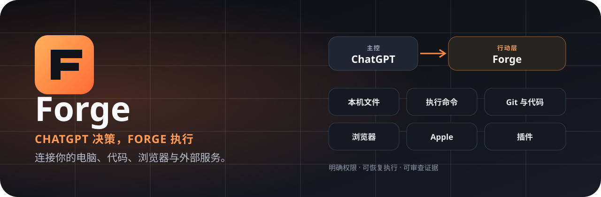

<a id="english"></a>

<p align="center"></p>
<p align="center"><strong>Give ChatGPT real, controlled hands on your computer, code, browser, and services.</strong></p>
<p align="center"><a href="#english">English</a> · <a href="#zh-cn">简体中文</a> · <a href="docs/README.md">Docs</a> · <a href="docs/operations/features.md">Features</a> · <a href="docs/forge-plugin-management.md">Plugins</a> · <a href="https://github.com/moretea-labs/forge/releases">Releases</a></p>
<p align="center">   </p>

**Forge has no internal AI brain.** One external controller owns semantic decisions; Forge provides the controlled execution, state, permissions, and recovery layer. ChatGPT is the recommended controller, but you can choose Codex, Claude, or another MCP client instead, and you may configure several controller entries while keeping one primary controller at a time.

With ChatGPT as the controller, Forge does **not** require a separate OpenAI API key or a second per-token model budget. Your existing ChatGPT plan/session limits still apply. Codex and Claude are not Forge dependencies unless you explicitly choose or configure them.

## What Forge gives ChatGPT

| Capability | What that means for you |
| --- | --- |
| **Your local computer** | Authorize a folder, then let ChatGPT list/read/write/copy/move files, create directories, open documents or Finder, run bounded commands, inspect processes, and manage verified macOS LaunchAgents. |
| **Real software work** | Inspect and edit repositories, run tests/builds, use Git and worktrees, keep long commands attached, verify results, commit, and clean temporary work. |
| **Browser + desktop** | Navigate, inspect, click, fill, screenshot, transfer files, and hand off when human interaction is required; Chrome/Vivaldi native attach and macOS desktop actions are supported where available. |
| **Apple workflows** | Build and inspect iOS projects, work with simulators/devices, and use App Store Connect for apps, builds, TestFlight, review state, and Xcode Cloud workflows. |
| **Your services** | Typed plugins for GitHub, Gmail, Google Calendar, Google Tasks, Resend, plus independently released Forge providers. |
| **Automation + recovery** | Long commands stay attached instead of being restarted; scheduled/recurring work can persist outside chat and hand control back to ChatGPT when reasoning is needed. Repository identity, checks, approvals, and recovery facts survive outside the conversation. |

### Ask for outcomes, not tools

```text
“Clean up these generated files, run the project checks, commit the fix, and remove the worktree.”
“Read this authorized folder, reorganize the documents, and open the result in Finder.”
“Open the web app, test this flow in Chrome, capture evidence, then fix the UI regression.”
“Summarize today’s inbox, archive obvious promotions, and prepare the important replies.”
“Check the latest TestFlight build and tell me what blocks release.”
```

Forge deliberately keeps the tool mechanics below the conversation. You describe the goal to your chosen external controller; that controller decides, while Forge enforces scope, persistence, execution policy, and evidence. Forge never invents an internal agent just because Codex or Claude happens to be installed.

## Start in minutes

Base install: **Node.js 20.10+, npm (or Bun), and a writable home directory**. Git is only required when you enable repository/software-work features; Codex and Claude are optional.

```bash
npm install -g @moretea-labs/forge
forge setup
# Recommended path; then follow one Next action at a time:
forge setup configure --controller chatgpt --tunnel auto
forge setup next
```

Setup persists progress and guides the selected path through the user-level Package Runtime, remote connectivity, controller registration, and connection verification. For ChatGPT, `--tunnel auto` now means **OpenAI Secure MCP Tunnel first**: Forge keeps the Canonical Runtime private, installs a loopback OAuth Gateway for ChatGPT, and lets the official `tunnel-client` carry MCP traffic outbound to OpenAI. Cloudflare Tunnel, Tailscale Funnel, an existing HTTPS `/mcp` URL, or deferred remote access remain explicit fallbacks when Secure Tunnel is unavailable. Local Codex/Claude controllers do not need a tunnel. The ChatGPT App/connector is the application identity; Secure Tunnel is only its network transport, so switching transport does not create a second Forge tool schema.

Then follow [Install and start](docs/tutorials/01-install-and-start.md) and [Connect ChatGPT](docs/tutorials/02-connect-chatgpt.md). A repository is optional during initial setup; add one later with `forge adopt --repo /path/to/your-project`. Upgrade an existing install with `npm install -g @moretea-labs/forge@latest`, verify with `forge --version`, then run `forge setup next` to reconcile newer Runtime/connector setup contracts.

For a reviewed source checkout: `git clone https://github.com/moretea-labs/forge.git && cd forge && bun install --frozen-lockfile && npm install -g . --omit=optional --no-audit --no-fund`.

## Built in, and extensible

Forge ships typed local/browser/desktop/iOS/GitHub/Gmail/Calendar/Tasks/App Store Connect/Resend capabilities. On macOS, manage the native **Computer** capability with `forge computer setup|status|doctor|update|uninstall`; Forge Desktop Operator remains the independently released native provider behind that product surface. The generic provider catalog also includes **Forge Design** and **Personal Knowledge Assistant** and remains available through `forge plugin catalog` / `forge plugin install <id>`. See [Features](docs/operations/features.md) and [Plugin Management](docs/forge-plugin-management.md).

## Controlled by design

Local read/write grants are explicit and expiring; remote or destructive effects are distinguished from ordinary local work; high-impact actions require stronger confirmation. Full Access reduces repetitive prompts for normal work without removing the hard boundaries around secrets, destructive actions, and outside-workspace access. See [Security](SECURITY.md) and the [Security Model](docs/wiki/Security-Model.md).

**Docs:** [Wiki](docs/wiki/Home.md) · [Support](SUPPORT.md) · [Contributing](CONTRIBUTING.md) · [Changelog](CHANGELOG.md). Current stable release: `1.7.0`; stable installs use npm `latest`.

---
<a id="zh-cn"></a>

<p align="center"></p>
<p align="center"><strong>让 ChatGPT 真正、安全地操作你的电脑、代码、浏览器和外部服务。</strong></p>
<p align="center"><a href="#english">English</a> · <a href="#zh-cn">简体中文</a> · <a href="docs/README.zh-CN.md">中文文档</a> · <a href="docs/operations/features.zh-CN.md">功能</a> · <a href="docs/forge-plugin-management.md">插件</a></p>

**Forge 自己没有 AI 大脑。** 语义判断始终由一个外部主控负责，Forge 负责受控执行、持久状态、权限和恢复。推荐 ChatGPT，也可以明确选择 Codex、Claude 或其他 MCP 客户端；可以预配置多个入口，但同一时刻只有一个主控负责决策。

选择 ChatGPT 时**不要求再配置一份 OpenAI API Key，也不需要额外准备一套按 token 计费的模型预算**；仍受你的 ChatGPT 套餐和会话限制。Codex、Claude 没被选中时就不是 Forge 的依赖。

## Forge 能让 ChatGPT 做什么

| 能力 | 用户真正得到什么 |
| --- | --- |
| **操作本机** | 授权一个目录后，可列出/读取/写入/复制/移动文件，创建目录，打开文档或 Finder，执行受控命令，查看进程并管理经过身份校验的 macOS LaunchAgent。 |
| **完成真实开发任务** | 读取和修改仓库、运行测试/构建、操作 Git/worktree、持续跟踪长命令、验证结果、提交并清理临时工作区。 |
| **浏览器与桌面** | 页面导航、读取、点击、填写、截图、文件传输；需要人工时再 handoff；可使用 Chrome/Vivaldi 原生 attach 与 macOS 桌面能力。 |
| **Apple 工作流** | iOS 构建、模拟器/设备，以及 App Store Connect 的版本、构建、TestFlight、审核状态和 Xcode Cloud。 |
| **连接你的服务** | GitHub、Gmail、Google Calendar、Google Tasks、Resend，以及独立发布的 Forge Provider。 |
| **自动化与可恢复执行** | 长命令不会因为聊天继续而重跑；定时/周期工作可以持久化，在需要判断时再交回 ChatGPT。仓库身份、检查、授权与恢复状态也不只存在于聊天上下文里。 |

```text
“把这个 bug 修好，跑完测试，提交，然后把临时 worktree 清掉。”
“读取我授权的这个目录，整理文件，并在 Finder 里打开结果。”
“在 Chrome 里把这个流程走一遍，截图核对，然后修 UI。”
“汇总今天邮件，把明显广告归档，重要邮件整理给我。”
“看最新 TestFlight 构建，告诉我离发布还差什么。”
```

## 快速开始

基础安装只需要 **Node.js 20.10+、npm（或 Bun）和可写用户目录**。Git 只在启用仓库/软件开发能力时需要；Codex、Claude 都是可选项。

```bash
npm install -g @moretea-labs/forge
forge setup
forge setup configure --controller chatgpt --tunnel auto
forge setup next     # 按每次显示的 Next 动作继续
```

远程主控的 setup 会继续引导 Package Runtime、远程连接、主控配置和连接验证；对 ChatGPT，`--tunnel auto` 现在明确表示 **优先 OpenAI Secure MCP Tunnel**。Forge 保持 Canonical Runtime 私有，并安装一个仅监听 loopback 的 OAuth Gateway，再由官方 `tunnel-client` 出站连接 OpenAI。只有 Secure Tunnel 不可用时才显式选择 Cloudflare Tunnel、Tailscale Funnel、已有 HTTPS `/mcp` 或暂缓远程连接。本地 Codex/Claude 主控不需要 tunnel。ChatGPT App/connector 是应用身份，Secure Tunnel 只是网络传输层，因此切换网络不会产生另一套 Forge 工具 schema。

继续阅读[安装与启动](docs/tutorials/01-install-and-start.zh-CN.md)和[连接 ChatGPT](docs/tutorials/02-connect-chatgpt.zh-CN.md)。仓库不是首次 setup 的前置条件，需要开发能力时再运行 `forge adopt --repo /path/to/your-project`。已安装用户升级：`npm install -g @moretea-labs/forge@latest`，确认 `forge --version` 后运行 `forge setup next` 让新版 setup 自动补齐 Runtime/connector 配置。源码安装：`git clone https://github.com/moretea-labs/forge.git && cd forge && bun install --frozen-lockfile && npm install -g . --omit=optional --no-audit --no-fund`。

Forge 内置本机、Browser、Desktop、iOS、GitHub、Gmail、Calendar、Tasks、App Store Connect、Resend 等类型化能力。macOS 原生 **Computer** 能力统一通过 `forge computer setup|status|doctor|update|uninstall` 管理；Forge Desktop Operator 仍作为其独立发布的原生 Provider 保持稳定身份。通用 Provider 目录还包含 **Forge Design / Personal Knowledge Assistant**，继续使用 `forge plugin catalog` / `forge plugin install <id>` 管理。详见[功能清单](docs/operations/features.zh-CN.md)与[插件管理](docs/forge-plugin-management.md)。

安全上，普通本地修改、远程影响、破坏性操作、密钥和工作区外访问是不同边界；Full Access 不会取消高风险确认。详见[安全说明](SECURITY.md)和[安全模型](docs/wiki/Security-Model.md)。

**文档：** [Wiki](docs/wiki/Home.md) · [支持](SUPPORT.md) · [贡献](CONTRIBUTING.md) · [更新日志](CHANGELOG.md)。当前稳定版为 `1.7.0`，稳定安装使用 npm `latest`。
