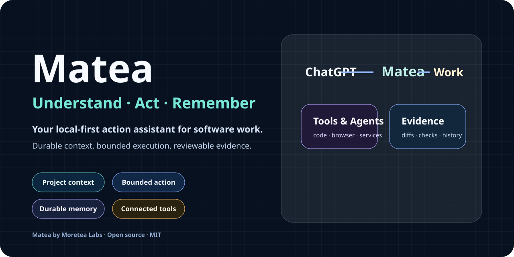

# Matea

<p align="center">
  
</p>

<p align="center"><strong>Your local-first action assistant for software work.</strong></p>

<p align="center"><a href="README.md">English</a> · <a href="README.zh-CN.md">简体中文</a></p>

Matea gives ChatGPT a durable local workspace for understanding projects, carrying out bounded actions, and returning reviewable evidence. It focuses on software repositories today and is designed to extend into connected tools, services, devices, and personal workflows without giving up local control.

## Why Matea

- **Context that survives the chat** — repository registration, plans, work state, handoffs, and verification evidence remain available across sessions.
- **Actions with clear boundaries** — normal local work can flow quickly, while remote writes, destructive effects, and secret access remain explicitly gated.
- **Reviewable execution** — patches, dedicated branches or worktrees, exact checks, and immutable release evidence make results inspectable.
- **One local controller, many repositories** — ChatGPT connects once, then work is routed to an explicitly selected repository and checkout.
- **A compact default workflow** — start with status, context, work, and verification; use advanced tools only when the task needs them.

## Release status

`1.4.0-rc.6` is the current GitHub release candidate for Matea. The npm package `@moretea-labs/matea` is **not public yet**, so source installation remains the currently verified package path. A GitHub prerelease and an npm publication are separate facts.

## Quick start

Requirements: Git, Node.js 20.10 or newer, npm, and a writable home directory. Bun 1.0+ is optional and recommended for source development and the complete test suite.

```bash
git clone https://github.com/moretea-labs/matea.git
cd matea
npm ci --ignore-scripts --no-audit --no-fund
npm install -g . --omit=optional --no-audit --no-fund

matea --version
matea init --target both
matea doctor
```

Register or adopt a repository:

```bash
matea adopt --repo /path/to/your-project --dry-run
matea adopt --repo /path/to/your-project
matea repo list --json
```

Then follow the maintained path:

1. [Install and start](docs/tutorials/01-install-and-start.md)
2. [Connect ChatGPT](docs/tutorials/02-connect-chatgpt.md)
3. [Complete the first repository task](docs/tutorials/03-first-repository-task.md)

When the npm RC is published:

```bash
npm install -g @moretea-labs/matea@next
# or, from the same npm package:
bun add -g @moretea-labs/matea@next
```

Bun consumes the same npm package; it does not have a separate publication or version line.

## Safety model

Matea separates reading, local repository changes, remote effects, destructive actions, and secret access. It keeps work scoped to a registered repository, records durable evidence, and fails closed when release identity or runtime ownership is ambiguous. See [Core Concepts](docs/wiki/Core-Concepts.md), [Work Lifecycle](docs/wiki/Work-Lifecycle.md), and [Security Model](docs/wiki/Security-Model.md).

## Compatibility

The `repo-harness` and `repo-harness-hook` commands remain compatibility aliases during the Matea 1.x migration. Existing `.repo-harness` runtime directories and protocol identifiers are intentionally preserved so the product rename does not invalidate local state or integrations.

## Documentation

- [Documentation hub](docs/README.md)
- [Wiki Home](docs/wiki/Home.md) and [GitHub Wiki](https://github.com/moretea-labs/matea/wiki)
- [Public usage guide](docs/public-usage-guide.md)
- [Platform support](docs/operations/platform-support.md)
- [Troubleshooting](docs/operations/troubleshooting.md)
- [Release process](docs/operations/releasing.md)

The README stays focused on first use. Architecture, lifecycle, integrations, recovery, and operator procedures live in versioned docs and the Wiki source.

## Project status and support

Matea remains in release-candidate hardening. Interfaces may change before `1.4.0`, and releases are created only from an immutable revision that passes the published release gate.

- Bugs and documentation: [GitHub Issues](https://github.com/moretea-labs/matea/issues)
- Usage questions: [SUPPORT.md](SUPPORT.md)
- Security reports: [SECURITY.md](SECURITY.md)
- Contributions: [CONTRIBUTING.md](CONTRIBUTING.md)
- Release history: [CHANGELOG.md](CHANGELOG.md)

## License and attribution

Licensed under the [MIT License](LICENSE). Matea began as a derivative of `AncientTwo/repo-harness` and has since developed into a substantially modified, independently maintained product. The upstream copyright and permission notice remain part of the distribution; see [NOTICE](NOTICE) and [THIRD_PARTY_NOTICES.md](THIRD_PARTY_NOTICES.md).
