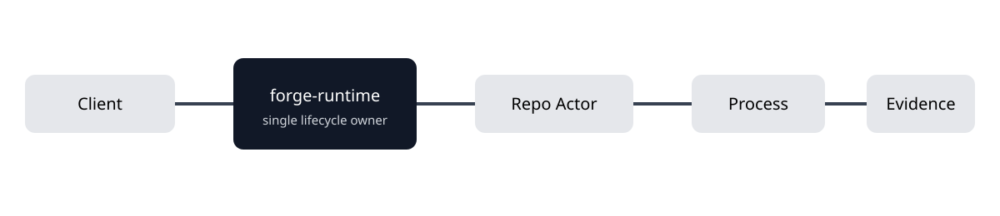

# Forge

<p align="center"></p>
<p align="center"><strong>面向 ChatGPT 与 AI 编程助手的本地优先行动运行时。</strong></p>
<p align="center"><a href="README.md#english">English</a> · <a href="README.md#zh-cn">仓库首页中文</a> · <a href="docs/README.zh-CN.md">中文文档</a> · <a href="https://github.com/moretea-labs/forge/releases">版本发布</a></p>
<p align="center">   </p>

Forge 让 ChatGPT 在**真实本地仓库、进程、插件和恢复状态**上执行有边界、可审查的工作。它把 Git、Process、检查和发布证据保存在聊天之外，小任务走最短路径，长任务复用同一个执行生命周期。

## 为什么使用 Forge

| 需求 | Forge 的处理方式 |
| --- | --- |
| 操作真实代码 | 使用稳定的 `repoId + checkoutId` 绑定目标仓库和 checkout。 |
| 小任务不要重流程 | Direct-first；仅调查不会自动创建 Plan、Issue、Agent 或 worktree。 |
| 长命令不要重复跑 | Process Runtime 只启动一次，后续 status/wait/log/cancel 连接同一个 Process。 |
| 多仓库并发工作 | 不同仓库可并行；真正需要隔离时才建立 worktree。 |
| 结果能够复核 | diff、focused check、receipt、evidence、不可变 Runtime release 与 Recovery 都可追溯。 |
| 安全扩展能力 | 官方 Provider 从固定版本目录安装，复用 Forge 的授权、资源声明和证据链。 |

## 快速开始

需要 Git、Node.js 20.10+、npm 和可写用户目录。源码开发建议安装 Bun 1.0+。

```bash
npm install -g @moretea-labs/forge@next
forge --version
forge setup open --target both
forge setup next     # 重复直到 ready
forge setup close
forge doctor
```

接入仓库：

```bash
forge adopt --repo /path/to/your-project --dry-run
forge adopt --repo /path/to/your-project
forge repo list --json
```

接下来按[连接 ChatGPT](docs/tutorials/02-connect-chatgpt.zh-CN.md)和[完成第一个仓库任务](docs/tutorials/03-first-repository-task.zh-CN.md)继续。源码开发可使用：

```bash
git clone https://github.com/moretea-labs/forge.git && cd forge
npm ci --ignore-scripts --no-audit --no-fund
npm install -g . --omit=optional --no-audit --no-fund
```

## ChatGPT 如何使用 Forge

普通 ChatGPT Connector 默认是 **19 个 MCP 工具**。五个主要 facade——`rh_status`、`rh_access`、`rh_inbox`、`rh_context`、`rh_work`——覆盖日常编排，其余默认工具负责仓库、源码/补丁、check、Process、插件分发和结果读取。

```text
小任务 → 状态/上下文 → Direct Edit → focused check → commit
长任务 → 确定身份 → 确有需要才建 durable work → Process/worktree → verify → integrate → clean
```

<p align="center"></p>

正常使用时直接描述目标即可，不需要自己挑工具。

## 官方 Provider

| Provider | 用途 | 安装 |
| --- | --- | --- |
| [Forge Desktop Operator](https://github.com/moretea-labs/forge-desktop-operator) | macOS 原生桌面操作 | `forge plugin install desktop_operator` |
| [Forge Design](https://github.com/moretea-labs/forge-design) | 仓库原生设计工作区和 `design.md` | `forge plugin install design` |
| [Personal Knowledge Assistant](https://github.com/moretea-labs/personal-knowledge-assistant) | 本地优先个人知识检索、记忆与安全写入 | `forge plugin install personal_knowledge` |

Forge 不扫描用户本机 sibling 仓库，也不允许模型临时提供任意 executable。完整边界见[插件管理](docs/forge-plugin-management.md)。Investment Decision System 保持独立产品，不进入 Forge 官方插件目录。

## 安全模型

Forge 区分读取、普通本地修改、远程影响、破坏性操作、工作区外访问和密钥访问。Full Access 只减少普通本地工作的重复授权，不会削弱 destructive、remote 或 secret 边界。详见[安全模型](docs/wiki/Security-Model.md)和 [SECURITY.md](SECURITY.md)。

## 文档

- **开始使用：** [中文文档中心](docs/README.zh-CN.md) · [安装](docs/tutorials/01-install-and-start.zh-CN.md) · [公开使用指南](docs/public-usage-guide.zh-CN.md)
- **理解系统：** [Wiki](docs/wiki/Home.md) · [核心概念](docs/wiki/Core-Concepts.md) · [架构](docs/wiki/Architecture.md) · [工作生命周期](docs/wiki/Work-Lifecycle.md)
- **运维维护：** [故障排查](docs/operations/troubleshooting.zh-CN.md) · [平台支持](docs/operations/platform-support.zh-CN.md) · [发布流程](docs/operations/releasing.zh-CN.md)
- **参与项目：** [贡献](CONTRIBUTING.md) · [安全](SECURITY.md) · [支持](SUPPORT.md) · [版本记录](CHANGELOG.md)

**当前候选版本：** `1.5.0-rc.1`，npm 使用 `next`；稳定版本使用 `latest`。项目采用 [MIT License](LICENSE)。
